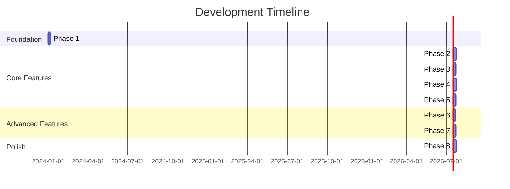

# Scan Prep - Development Roadmap

## Overview

This roadmap breaks down the image splitting application into **8 manageable phases**, each delivering working functionality that can be demonstrated, tested, and reviewed as an independent PR. Each phase builds incrementally toward the final application while maintaining a runnable state.

---

## 📋 Phase 1: Foundation Setup
**Goal:** Establish the basic Electron + React + TypeScript foundation with dark-themed 3-column layout

### Deliverables
- [ ] Electron application with TypeScript configuration
- [ ] React setup with Tailwind CSS dark theme
- [ ] Basic 3-column layout structure
- [ ] Window management and basic menu
- [ ] Development build pipeline

### Technical Tasks
```typescript
// Key files to create:
- src/main/main.ts                 // Electron entry point
- src/main/window-manager.ts       // Window creation/management
- src/renderer/App.tsx             // Main React component
- src/renderer/components/Layout/ThreeColumnLayout.tsx
- tailwind.config.js              // Dark theme configuration
- webpack.config.js               // Build configuration
```

### Acceptance Criteria
- ✅ Application launches with dark-themed window
- ✅ 3 clearly defined columns visible
- ✅ Responsive layout that adapts to window resizing
- ✅ Development hot-reload working
- ✅ TypeScript compilation without errors

### Demo
- Show application launching
- Demonstrate column layout and dark theme
- Show window resizing behavior

---

## 📂 Phase 2: File Explorer (Left Column)
**Goal:** Implement directory navigation and file listing functionality

### Deliverables
- [ ] Directory path input with validation
- [ ] File system browsing via IPC
- [ ] Thumbnail/list view toggle
- [ ] Directory tree navigation
- [ ] Image file filtering

### Technical Tasks
```typescript
// New components:
- src/renderer/components/FileExplorer/PathInput.tsx
- src/renderer/components/FileExplorer/ViewToggle.tsx
- src/renderer/components/FileExplorer/FileList.tsx
- src/renderer/components/FileExplorer/DirectoryTree.tsx

// Main process services:
- src/main/services/FileManager.ts
- src/main/ipc-handlers.ts (file operations)

// IPC messages:
- 'file:read-directory'
- 'file:validate-path'
- 'file:get-file-info'
```

### Acceptance Criteria
- ✅ User can enter directory path and see validation
- ✅ File list displays supported image formats (JPEG, PNG, TIFF)
- ✅ Toggle between thumbnail and list views works
- ✅ Directory navigation (folders expand/collapse)
- ✅ File selection highlights the chosen image
- ✅ Error handling for invalid paths

### Demo
- Navigate to different directories
- Show thumbnail vs list view toggle
- Select various image files
- Demonstrate error handling

---

## 🖼️ Phase 3: Image Preview (Middle Column)
**Goal:** Display selected images with basic preview functionality

### Deliverables
- [ ] Image loading and display via IPC
- [ ] Empty state with "Select an image" message
- [ ] Image scaling and centering
- [ ] Basic error handling for corrupted images
- [ ] Loading states and progress indicators

### Technical Tasks
```typescript
// New components:
- src/renderer/components/ImagePreview/EmptyState.tsx
- src/renderer/components/ImagePreview/ImageDisplay.tsx
- src/renderer/components/ImagePreview/LoadingSpinner.tsx

// Main process updates:
- src/main/services/ImageProcessor.ts (basic loading)
- Add 'image:load' IPC handler

// State management:
- src/renderer/stores/imageStore.ts (basic image state)
```

### Acceptance Criteria
- ✅ Empty state shows when no image selected
- ✅ Selected image displays properly scaled and centered
- ✅ Loading indicator during image load
- ✅ Error message for unsupported/corrupted files
- ✅ Image fits within column boundaries
- ✅ Handles large images without memory issues

### Demo
- Select images from file explorer
- Show different image sizes and formats
- Demonstrate error handling
- Show loading states

---

## ✂️ Phase 4: Intelligent Image Analysis
**Goal:** Implement automatic sub-image detection with dynamic rotation analysis

### Deliverables
- [ ] "Analyze" button in middle column
- [ ] Computer vision pipeline for sub-image detection
- [ ] Dynamic rotation detection for each sub-image
- [ ] Green overlay rectangles showing detected regions
- [ ] Progress indication for analysis operation

### Technical Tasks
```typescript
// Updated components:
- src/renderer/components/ImagePreview/AnalyzeButton.tsx
- src/renderer/components/ImagePreview/DetectionOverlay.tsx

// Main process analysis logic:
- src/main/services/ImageAnalysisService.ts (computer vision implementation)
- Add 'image:analyze' IPC handler

// Shared types:
- src/shared/types.ts (DetectedSubImage, AnalysisResult interfaces)

// Computer vision pipeline:
- Edge detection and contour finding
- Rectangular region filtering
- Rotation angle detection
- Confidence scoring
```

### Acceptance Criteria
- ✅ "Analyze" button triggers computer vision analysis
- ✅ Green overlay rectangles appear over detected sub-images
- ✅ Each rectangle shows correct rotation (not just 90° increments)
- ✅ Analysis completes within reasonable time (< 10 seconds for typical scans)
- ✅ False positive detection rate is acceptably low
- ✅ Progress indicator shows during analysis

### Demo
- Show analysis of various scanned documents
- Demonstrate detection of rotated sub-images
- Show green overlay rectangles with dynamic rotations
- Verify analysis performance and accuracy

---

## 🔲 Phase 5: Sub-Image Extraction and Preview Grid
**Goal:** Extract detected sub-images and display corrected previews in right column

### Deliverables
- [ ] Sub-image extraction with rotation correction
- [ ] Perspective correction for skewed documents
- [ ] Right column grid showing extracted image previews
- [ ] Empty state with "Analyze an image" message
- [ ] Confidence indicators for each detection

### Technical Tasks
```typescript
// New components:
- src/renderer/components/SubImageGrid/EmptyState.tsx
- src/renderer/components/SubImageGrid/ExtractedImagePreview.tsx
- src/renderer/components/SubImageGrid/ConfidenceIndicator.tsx

// Extraction and correction:
- src/main/services/ImageAnalysisService.ts (extraction methods)
- Add 'image:extract-subimage' IPC handler
- Implement perspective correction algorithms

// State management:
- Update imageStore for detected and extracted images
```

### Acceptance Criteria
- ✅ Empty state shows before any analysis
- ✅ Extracted sub-images display in grid after analysis
- ✅ Images are properly rotated and perspective-corrected
- ✅ Grid adapts to variable number of detected images
- ✅ Confidence scores visible for each detection
- ✅ Low-confidence detections clearly marked

### Demo
- Show empty state initially
- Analyze an image and see extracted previews populate
- Demonstrate rotation and perspective correction
- Show confidence indicators and low-confidence handling

---

## 🔄 Phase 6: Detection Refinement and Manual Adjustment
**Goal:** Allow users to refine automatic detections and add manual regions

### Deliverables
- [ ] Click-to-select detection rectangles
- [ ] Manual rotation adjustment for selected regions
- [ ] Add/remove detection regions manually
- [ ] Real-time preview updates when adjusting
- [ ] Re-analyze button for processing changes

### Technical Tasks
```typescript
// Updated components:
- src/renderer/components/ImagePreview/InteractiveOverlay.tsx
- src/renderer/components/ImagePreview/ManualControls.tsx
- src/renderer/components/SubImageGrid/PreviewUpdater.tsx

// Manual adjustment logic:
- src/main/services/ImageAnalysisService.ts (manual region handling)
- Add 'image:adjust-detection' IPC handler
- Add 'image:add-manual-region' IPC handler

// Interactive features:
- Click and drag to adjust rectangles
- Rotation handles on selected regions
- Add new region tool
```

### Acceptance Criteria
- ✅ Click to select detection rectangles
- ✅ Drag handles to resize selected regions
- ✅ Rotation control for fine-tuning angles
- ✅ Add new detection regions manually
- ✅ Delete unwanted detections
- ✅ Real-time preview updates in right column

### Demo
- Select and adjust detection rectangles
- Fine-tune rotation angles manually
- Add missing regions the algorithm didn't detect
- Show real-time preview updates

---

## 💾 Phase 7: Export Functionality
**Goal:** Implement saving individual and batch export capabilities for extracted images

### Deliverables
- [ ] Save button for individual extracted sub-images
- [ ] "Save All" button for batch export
- [ ] Smart file naming based on detection order
- [ ] Save location selection
- [ ] Export progress and confirmation

### Technical Tasks
```typescript
// Updated components:
- src/renderer/components/SubImageGrid/ExtractedImageActions.tsx (save button)
- src/renderer/components/SubImageGrid/BatchActions.tsx (save all)

// Export logic:
- src/main/services/ExportManager.ts
- Add 'export:save-extracted-image' and 'export:save-all-extracted' IPC handlers

// File naming:
- Smart naming based on detection position and confidence
- Handle duplicate names gracefully
```

### Acceptance Criteria
- ✅ Individual save button opens file dialog
- ✅ "Save All" opens folder selection dialog
- ✅ Files saved with logical naming (detected-1.jpg, detected-2.jpg, etc.)
- ✅ Progress indication for batch saves
- ✅ Success/error feedback for save operations
- ✅ Handles save conflicts gracefully

### Demo
- Save individual extracted images
- Demonstrate "Save All" functionality
- Show intelligent file naming
- Test error handling (permissions, disk space)

---

## ✨ Phase 8: Advanced Features & Polish
**Goal:** Advanced computer vision features and final user experience improvements

### Deliverables
- [ ] Multiple analysis algorithms (user selectable)
- [ ] Batch analysis for multiple scanned pages
- [ ] Keyboard shortcuts for common actions
- [ ] Drag & drop file support
- [ ] Performance optimization for large images

### Technical Tasks
```typescript
// Advanced features:
- Multiple detection algorithms (conservative, aggressive, etc.)
- Batch processing queue for multiple images
- Algorithm performance comparison
- Memory optimization for large scans

// UX improvements:
- Keyboard navigation and shortcuts
- Drag & drop handlers
- Better loading states and animations
- Advanced settings panel

// Performance:
- Parallel processing for multiple regions
- Image caching strategies
- Memory leak prevention
- Large file handling improvements
```

### Acceptance Criteria
- ✅ Multiple analysis modes available (conservative/aggressive)
- ✅ Process multiple images in sequence
- ✅ Keyboard shortcuts work (Ctrl+A for analyze, Ctrl+S for save)
- ✅ Drag & drop images from file system
- ✅ Smooth performance with large scans (>20MB)
- ✅ Professional, polished user interface

### Demo
- Show different analysis algorithm modes
- Demonstrate batch processing multiple images
- Show keyboard shortcuts in action
- Test with very large scanned documents
- Show final polished experience

---

## 🚀 Phase Timeline & Dependencies



## 📝 PR Review Guidelines

### For Each Phase PR:
1. **Functionality Demo**: Include GIF/video showing new features
2. **Test Coverage**: Unit tests for new components/services
3. **Documentation**: Update README with new capabilities
4. **Performance**: Memory usage and response time benchmarks
5. **Error Handling**: Demonstrate error cases and recovery

### Merge Criteria:
- ✅ All acceptance criteria met
- ✅ No TypeScript errors or ESLint warnings
- ✅ Manual testing completed successfully
- ✅ Performance requirements satisfied
- ✅ Code review approved by team

This roadmap ensures steady progress with deliverable milestones at each phase, making the development process manageable and reviewable while building toward a complete, professional image splitting application. 