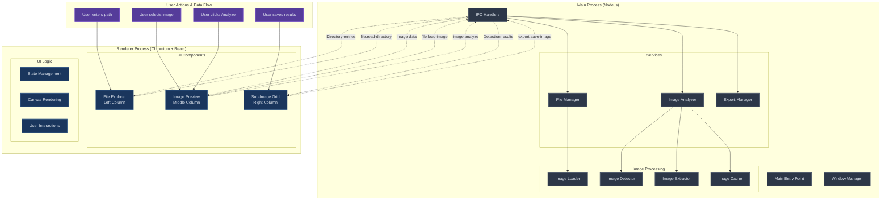

# Scan Prep - Technical Design Proposal

## Overview

Scan Prep is an Electron-based desktop application designed specifically for **lossless splitting of scanned images** into separate sub-images. The application features a **3-column dark-themed interface** that allows users to navigate files, preview images, automatically detect sub-images within scans, and export the individual results.

## Technology Stack

### Core Framework
- **Electron**: Cross-platform desktop application framework
- **TypeScript**: Type-safe JavaScript development
- **Node.js**: Backend runtime environment

### Image Processing
- **image-js**: Primary image processing library for lossless operations
- **Canvas API**: Browser-native rendering for image display

### Frontend
- **React**: Component-based UI framework
- **Tailwind CSS**: Utility-first CSS framework with dark theme support

### Development Tools
- **Webpack**: Module bundling and build optimization
- **ESLint + Prettier**: Code quality and formatting
- **Jest**: Unit testing framework

## Application Architecture

### High-Level Architecture

```
┌─────────────────────────────────────┐
│            Main Process             │
│  (Node.js + Electron Main Thread)  │
├─────────────────────────────────────┤
│  • File System Operations          │
│  • Image Analysis Engine           │
│  • Lossless Image Extraction       │
│  • Export/Save Operations          │
│  • Menu & Window Management        │
│  • IPC Communication Hub           │
└─────────────────────────────────────┘
                    │
            IPC (optimized data transfer)
                    │
┌─────────────────────────────────────┐
│          Renderer Process          │
│     (Chromium + React + TS)        │
├─────────────────────────────────────┤
│  ┌─────────────────────────────────┐│
│  │     3-Column UI Layout          ││
│  │  • File Explorer (Left)         ││
│  │  • Image Preview (Middle)       ││
│  │  • Sub-Image Grid (Right)       ││
│  └─────────────────────────────────┘│
│  ┌─────────────────────────────────┐│
│  │      UI Logic Only              ││
│  │  • Canvas Rendering             ││
│  │  • User Interactions            ││
│  │  • State Management             ││
│  │  • Visual Components            ││
│  └─────────────────────────────────┘│
└─────────────────────────────────────┘
```

### Architecture Flow Diagram



**Key Architectural Principles:**

1. **Process Separation by Capability**
   - **Main Process**: All heavy computation (file I/O, image analysis, extraction)
   - **Renderer Process**: Pure UI logic and user interactions

2. **Lossless Operations**
   - Image analysis doesn't modify original data
   - Extraction preserves image quality
   - No compression or enhancement applied

3. **Optimized Data Transfer**
   - Send metadata over IPC rather than large image buffers
   - Stream results efficiently between processes
   - Cache analysis results to avoid recomputation

### Project Structure

```
scan-prep/
├── src/
│   ├── main/                    # Main process code
│   │   ├── main.ts             # Application entry point
│   │   ├── window-manager.ts   # Window management
│   │   ├── ipc-handlers.ts     # IPC communication handlers
│   │   └── services/           # Core business logic
│   │       ├── ImageAnalyzer.ts    # Image analysis engine
│   │       ├── FileManager.ts      # File system operations
│   │       └── ExportManager.ts    # Save/export operations
│   ├── renderer/               # Renderer process code
│   │   ├── components/         # React components
│   │   │   ├── FileExplorer/   # Left column - file navigation
│   │   │   ├── ImagePreview/   # Middle column - image preview & analysis
│   │   │   ├── SubImageGrid/   # Right column - results display
│   │   │   └── Layout/         # 3-column layout wrapper
│   │   ├── hooks/              # React hooks
│   │   ├── stores/             # UI state management
│   │   ├── utils/              # UI utility functions
│   │   └── App.tsx             # Main React component
│   └── shared/                 # Shared code between processes
│       ├── types.ts            # Common type definitions
│       └── constants.ts        # Shared constants
├── docs/                       # Documentation
├── mockups/                    # UI mockups and wireframes
└── tests/                      # Test files
```

## Core Features and Modules

### 1. File Navigation and Management
- **Directory Path Input**: Manual path entry with validation
- **View Modes**: Toggle between thumbnail and list view
- **File Support**: JPEG, PNG, TIFF formats
- **Directory Tree**: Expandable/collapsible folder navigation
- **File Selection**: Single image selection for processing

### 2. Intelligent Image Analysis Pipeline
- **Automatic Detection**: Computer vision algorithms to identify document regions within scanned images
- **Dynamic Rotation Detection**: Identify rotation at any angle for proper extraction
- **Confidence Scoring**: Rate detection quality to help users validate results
- **Manual Refinement**: Allow users to adjust, add, or remove detected regions
- **Lossless Extraction**: Extract sub-images without quality degradation

### 3. User Interface Components

#### Column 1: File Explorer Component
- **Path Input Field**: Directory path entry with validation and auto-completion
- **View Toggle Buttons**: Switch between thumbnail and list view modes
- **Directory Tree**: Hierarchical folder navigation with file filtering

#### Column 2: Image Preview Component
- **Empty State**: Centered prompt to select an image
- **Image Display**: Centered image with proper scaling and responsiveness
- **Detection Overlay**: Interactive green rectangles showing detected regions with rotation indicators
- **Analysis Controls**: "Analyze" button and analysis mode selection

#### Column 3: Sub-Image Grid Component
- **Empty State**: Centered prompt to analyze an image
- **Extracted Image Grid**: Variable grid layout displaying extracted sub-image previews
- **Confidence Indicators**: Visual indication of detection confidence for each result
- **Export Controls**: Individual and batch save functionality

### 4. Dark Theme Implementation
- **Consistent Color Palette**: Professional dark theme across all components
- **High Contrast**: Optimized for readability and extended use
- **Accessibility**: Proper contrast ratios and visual hierarchy

## Image Processing Integration

For detailed information about the sub-image extraction algorithms and implementation approach, see [Sub-Image Extraction Concepts](./sub-image-extraction.md).

### Analysis Pipeline Architecture

1. **Image Loading**: Load selected image from file system without modification
2. **Detection Phase**: 
   - Edge detection to identify document boundaries
   - Contour analysis to find rectangular regions
   - Rotation analysis for each detected region
   - Confidence scoring for detection quality
3. **Preview Generation**: Display green overlay rectangles with detected orientations
4. **Sub-Image Extraction**: Extract regions with rotation correction while maintaining lossless quality
5. **Grid Display**: Show extracted sub-image previews in right column
6. **Export Operations**: Save individual or all extracted sub-images

### Processing Pipeline Characteristics
- **Lossless Operations**: All image manipulations preserve original quality
- **Non-Destructive**: Original image remains unmodified throughout process
- **Rotation Correction**: Apply rotation correction during extraction, not preview
- **Format Preservation**: Maintain original image format and metadata where possible

## Data Flow and IPC Communication

### Why IPC is Essential

Electron applications run in **two isolated processes** for security and stability:

- **Renderer Process** (React UI): Runs in a sandboxed browser environment with no direct file system access
- **Main Process** (Node.js): Has full system access but cannot directly manipulate the DOM

**IPC (Inter-Process Communication) is required because:**
1. **File Operations**: React components cannot read directories or load images directly
2. **Security**: Browser security model prevents direct file system access from UI code  
3. **Image Processing**: Heavy operations are better handled in the main process to avoid UI blocking
4. **File Saving**: Export operations require Node.js file system APIs unavailable to the renderer

For this image splitting application, the renderer handles UI interactions while the main process manages all file I/O, making IPC the essential bridge between user actions and system operations.

### Message Categories
- **File Operations**: Directory reading, path validation, image loading
- **Image Analysis**: Detection processing, extraction operations, manual adjustments
- **Export Operations**: Individual and batch saving functionality

### State Management Architecture
- **Application State**: Current directory, selected image, analysis results
- **Detection State**: Detected regions, confidence scores, manual adjustments
- **Processing State**: Analysis progress, extraction status, export operations
- **UI State**: View modes, selected elements, user preferences

## Performance Considerations

### Memory Management
- **Efficient Analysis**: Process images without multiple copies in memory
- **Result Caching**: Cache analysis results to avoid recomputation
- **Garbage Collection**: Proper cleanup of image objects after processing
- **Streaming Operations**: Handle large images through efficient data streaming

### User Experience
- **Progress Indicators**: Real-time feedback for analysis and extraction operations
- **Responsive UI**: Maintain smooth interactions during processing
- **Error Handling**: Graceful handling of unsupported files or processing errors
- **Performance Limits**: Reasonable constraints to prevent memory exhaustion

## Security and File Handling

### File System Security
- **Sandboxed Access**: All file operations occur in the secure main process
- **Input Validation**: Verify file types and sizes before processing
- **Path Sanitization**: Prevent directory traversal and unauthorized access
- **Temporary File Management**: Secure cleanup of processing artifacts

### Privacy Considerations
- **Local Processing**: All analysis and extraction performed locally
- **No External Dependencies**: Completely offline operation
- **Data Isolation**: No data transmitted outside the application
- **Secure Cleanup**: Proper disposal of sensitive image data

## Conclusion

This technical design provides a focused foundation for building a specialized image splitting application. The architecture emphasizes lossless operations, intelligent detection, and user refinement capabilities while maintaining optimal performance and security.

The combination of Electron, TypeScript, and image-js provides the necessary platform for creating a professional tool that meets the specific requirements of users who need to extract individual documents or images from scanned composite images. 